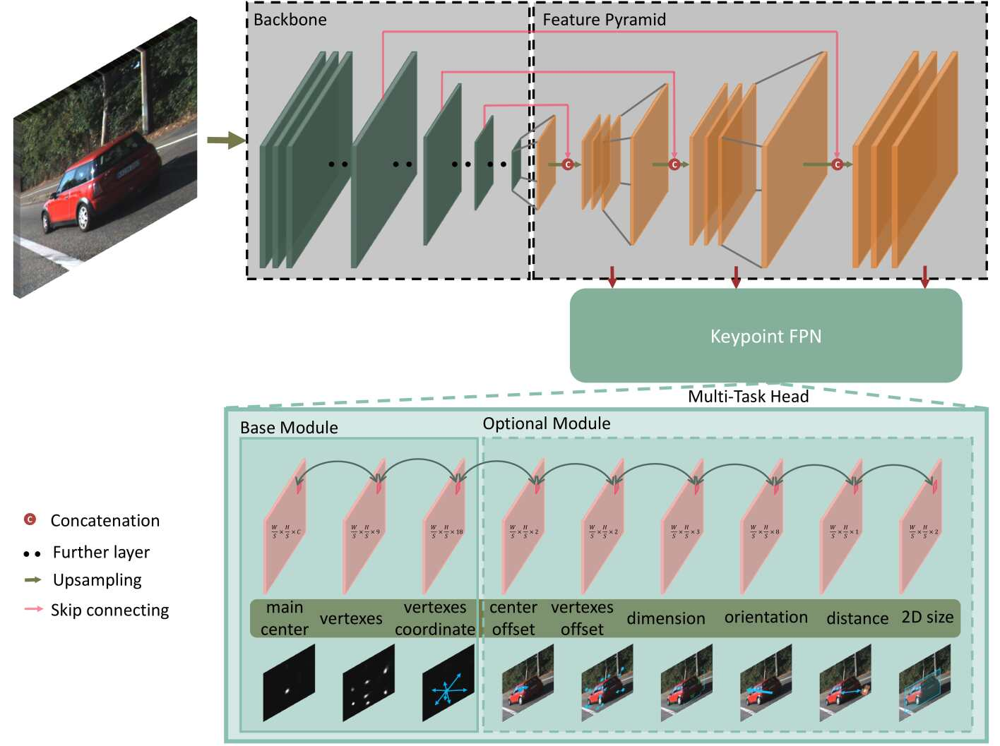

# RTM3D-PyTorch

[![python-image]][python-url]
[![pytorch-image]][pytorch-url]

The PyTorch Implementation of the paper: 
[RTM3D: Real-time Monocular 3D Detection from Object Keypoints for Autonomous Driving](https://arxiv.org/pdf/2001.03343.pdf) (ECCV 2020)

---

## Features
- [x] Realtime 3D object detection based on a monocular RGB image
- [x] Support [distributed data parallel training](https://github.com/pytorch/examples/tree/master/distributed/ddp)
- [x] Tensorboard


## To do list
- [ ] Implement the Keypoint FPN in the model
- [ ] Implement part 3.2 (3D Bounding Box Estimation part), revise _**(formula (7))**_
- [ ] Revise loss for depth estimation _**(formula (3))**_ (normalize depth maybe < 0 --> couldn't apply log operator)
- [ ] Release pre-trained models


## 2. Getting Started
### 2.1. Requirement

```shell script
pip install -U -r requirements.txt
```

### 2.2. Data Preparation
Download the 3D KITTI detection dataset from [here](http://www.cvlibs.net/datasets/kitti/eval_object.php?obj_benchmark=3d).

The downloaded data includes:

- Training labels of object data set _**(5 MB)**_
- Camera calibration matrices of object data set _**(16 MB)**_
- Left color images of object data set _**(12 GB)**_

Please make sure that you construct the source code & dataset directories structure as below.

### 2.3. RTM3D architecture





The model takes **only the RGB images** as the input and outputs the `main center heatmap`, `vertexes heatmap`, 
and `vertexes coordinate` as the base module to estimate `3D bounding box`.

### 2.4. How to run

#### 2.4.1. Visualize the dataset 

```shell script
cd src/data_process
```

- To visualize camera images (with 3D boxes), let's execute:

```shell script
python kitti_dataset.py
```

Then _Press **n** to see the next sample >>> Press **Esc** to quit..._


#### 2.4.2. Inference

Download the trained model from [**_here_**](https://drive.google.com/drive/folders/1lKOLHhWZasoC7cKNLcB714LBDS91whCr?usp=sharing), 
then put it to `${ROOT}/checkpoints/` and execute:

```shell script
python test.py --gpu_idx 0 --arch resnet_18 --pretrained_path ../checkpoints/rtm3d_resnet_18.pth
```

#### 2.4.3. Evaluation

```shell script
python evaluate.py --gpu_idx 0 --arch resnet_18 --pretrained_path <PATH>
```

#### 2.4.4. Training

##### 2.4.4.1. Single machine, single gpu

```shell script
python train.py --gpu_idx 0 --batch_size <N> --num_workers <N>...
```

##### 2.4.4.2. Multi-processing Distributed Data Parallel Training
We should always use the `nccl` backend for multi-processing distributed training since it currently provides the best 
distributed training performance.

- **Single machine (node), multiple GPUs**

```shell script
python train.py --dist-url 'tcp://127.0.0.1:29500' --dist-backend 'nccl' --multiprocessing-distributed --world-size 1 --rank 0
```

- **Two machines (two nodes), multiple GPUs**

_**First machine**_

```shell script
python train.py --dist-url 'tcp://IP_OF_NODE1:FREEPORT' --dist-backend 'nccl' --multiprocessing-distributed --world-size 2 --rank 0
```
_**Second machine**_

```shell script
python train.py --dist-url 'tcp://IP_OF_NODE2:FREEPORT' --dist-backend 'nccl' --multiprocessing-distributed --world-size 2 --rank 1
```

To reproduce the results, you can run the bash shell script

```bash
./train.sh
```


#### Tensorboard

- To track the training progress, go to the `logs/` folder and 

```shell script
cd logs/<saved_fn>/tensorboard/
tensorboard --logdir=./
```

- Then go to [http://localhost:6006/](http://localhost:6006/):


## Contact

If you think this work is useful, please give me a star! <br>
If you find any errors or have any suggestions, please contact me (**Email:** `nguyenmaudung93.kstn@gmail.com`). <br>
Thank you!


## Citation

```bash
@article{RTM3D,
  author = {Peixuan Li,  Huaici Zhao, Pengfei Liu, Feidao Cao},
  title = {RTM3D: Real-time Monocular 3D Detection from Object Keypoints for Autonomous Driving},
  year = {2020},
  conference = {ECCV 2020},
}
@misc{RTM3D-PyTorch,
  author =       {Nguyen Mau Dung},
  title =        {{RTM3D-PyTorch: PyTorch Implementation of the RTM3D paper}},
  howpublished = {\url{https://github.com/maudzung/RTM3D-PyTorch}},
  year =         {2020}
}
```

## References

[1] CenterNet: [Objects as Points paper](https://arxiv.org/abs/1904.07850), [PyTorch Implementation](https://github.com/xingyizhou/CenterNet)


## Folder structure

```
${ROOT}
└── checkpoints/    
    ├── rtm3d_resnet_18.pth
└── dataset/    
    └── kitti/
        ├──ImageSets/
        │   ├── test.txt
        │   ├── train.txt
        │   └── val.txt
        ├── training/
        │   ├── image_2/
        │   ├── calib/
        │   ├── label_2/
        └── testing/  
        │   ├── image_2/
        │   ├── calib/
        └── classes_names.txt
└── src/
    ├── config/
    │   ├── train_config.py
    │   └── kitti_config.py
    ├── data_process/
    │   ├── kitti_dataloader.py
    │   ├── kitti_dataset.py
    │   ├── kitti_data_utils.py
    │   └── transformation.py
    ├── models/
    │   ├── resnet.py
    │   ├── model_utils.py
    └── utils/
    │   ├── evaluation_utils.py
    │   ├── logger.py
    │   ├── misc.py
    │   ├── torch_utils.py
    │   ├── train_utils.py
    ├── evaluate.py
    ├── test.py
    ├── train.py
    └── train.sh
├── README.md 
└── requirements.txt
```


[python-image]: https://img.shields.io/badge/Python-3.6-ff69b4.svg
[python-url]: https://www.python.org/
[pytorch-image]: https://img.shields.io/badge/PyTorch-1.5-2BAF2B.svg
[pytorch-url]: https://pytorch.org/
